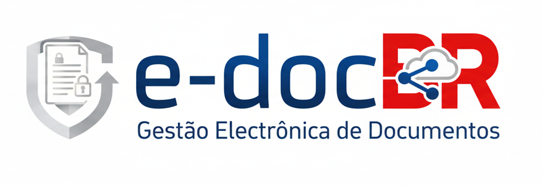

# 🎨 Identidade Visual - e-docBR GEDCMM

## 📋 Guia de Uso da Logo

Este documento define as diretrizes de uso da identidade visual do sistema e-docBR GEDCMM.

---

## 🖼️ Logo Principal

### Logo e-docBR

<div align="center">
  
</div>

**Características:**
- **Elementos**: Escudo com documento e cadeado (segurança) + "e-doc" em azul + "BR" em vermelho com nuvem
- **Slogan**: "Gestão Eletrônica de Documentos"
- **Cores principais**: Azul institucional (#1B4F8C) e Vermelho BR (#E30613)
- **Fundo**: Gradiente escuro (azul para verde-azulado)

---

## 🎨 Paleta de Cores

### Cores Primárias

```css
--edocbr-blue-primary:   #1B4F8C    /* Azul principal do logo "e-doc" */
--edocbr-red-primary:    #E30613    /* Vermelho do "BR" */
--edocbr-white:          #FFFFFF    /* Branco do escudo e texto */
```

### Cores Secundárias

```css
--edocbr-navy:           #0A2647    /* Azul escuro do fundo */
--edocbr-teal:           #205072    /* Verde-azulado do degradê */
--edocbr-cloud-blue:     #56C1E8    /* Azul claro da nuvem */
--edocbr-shield-gray:    #B8C5D0    /* Cinza do escudo */
```

### Cores de UI (baseadas em Alfresco)

```css
--alfresco-blue:         #00A3E0    /* Azul Alfresco oficial */
--alfresco-green:        #00AB8E    /* Verde Alfresco */
--alfresco-orange:       #FF9E00    /* Laranja para avisos */
```

### Cores de Status

```css
--success:               #27AE60    /* Verde sucesso */
--warning:               #F39C12    /* Amarelo aviso */
--error:                 #E74C3C    /* Vermelho erro */
--info:                  #3498DB    /* Azul informação */
```

---

## 📐 Especificações Técnicas

### Dimensões Recomendadas

| Uso | Largura | Altura | Formato |
|-----|---------|--------|---------|
| Logo principal | 800px | 200px | PNG |
| Logo header web | 400px | 100px | PNG/SVG |
| Logo mobile | 200px | 50px | PNG/SVG |
| Ícone app | 512px | 512px | PNG |
| Favicon | 32px | 32px | ICO/PNG |

### Variações da Logo

```
assets/images/
├── edocbr-logo.png              # Logo completa (fundo escuro original)
├── edocbr-logo-light-bg.png     # Logo para fundos claros
├── edocbr-logo-white.png        # Logo monocromática branca
├── edocbr-logo-horizontal.png   # Versão horizontal compacta
├── edocbr-icon-shield.png       # Apenas o escudo (ícone)
├── edocbr-icon-square.png       # Ícone quadrado para apps
├── edocbr-favicon.ico           # Favicon para navegadores
└── alfresco-logo.png            # Logo Alfresco (parceiro)
```

---

## 🎯 Contextos de Uso

### 1. **GitHub Repository**

```markdown
<div align="center">
  
  
  # Alfresco GED Integration (GEDCMM)
</div>
```

**Resultado**: Logo centralizada no topo do README.md

---

### 2. **Web Application Header**

```html
<header class="app-header">
  
</header>
```

**Resultado**: Logo compacta no cabeçalho da aplicação web

---

### 3. **Login Page**

```html
<div class="login-container">
  
  
  <!-- Alfresco login form -->
  
</div>
```

**Resultado**: Logo e-docBR acima do formulário de login, logo Alfresco abaixo

---

### 4. **Dashboard/Interface Principal**

```tsx
// React Component
const AppHeader = () => (
  <AppBar position="fixed">
    <Toolbar>
      <Box sx={{ display: 'flex', alignItems: 'center', gap: 2 }}>
        
        <Typography variant="h6" sx={{ color: '#1B4F8C', fontWeight: 600 }}>
          GEDCMM Dashboard
        </Typography>
      </Box>
      
      <Box sx={{ ml: 'auto', display: 'flex', gap: 1, alignItems: 'center' }}>
        <Chip 
          icon={<CloudIcon />}
          label="Alfresco Connected"
          size="small"
          color="primary"
        />
      </Box>
    </Toolbar>
  </AppBar>
);
```

---

### 5. **Documentação**

Para documentação Markdown (README, CONTRIBUTING, etc.):

```markdown
---

<div align="center">
  
### 🏢 Sobre a e-docBR


**Gestão Eletrônica de Documentos**

Desenvolvido com ❤️ pela equipe [e-docBR](https://github.com/e-docBR)

© 2024-2026 e-docBR. Todos os direitos reservados.

</div>
```

---

### 6. **Emails e Notificações**

```html
<!-- Template de email -->
<table width="600" style="margin: 0 auto; font-family: Arial, sans-serif;">
  <tr>
    <td style="background: linear-gradient(135deg, #1B4F8C, #205072); padding: 20px; text-align: center;">
      
    </td>
  </tr>
  <tr>
    <td style="padding: 30px; background: #ffffff;">
      <!-- Conteúdo do email -->
    </td>
  </tr>
  <tr>
    <td style="background: #f8f9fa; padding: 20px; text-align: center; font-size: 12px; color: #6c757d;">
      © 2026 e-docBR - Gestão Eletrônica de Documentos
    </td>
  </tr>
</table>
```

---

## 🚫 Diretrizes de Uso - NÃO FAZER

### ❌ Proibido

1. **Não distorcer** - Manter proporção original sempre
2. **Não rotacionar** - Logo deve estar sempre horizontal
3. **Não alterar cores** - Usar cores originais ou versões aprovadas
4. **Não adicionar efeitos** - Sem sombras, brilhos ou 3D não aprovados
5. **Não sobrepor elementos** - Manter área de respiro ao redor
6. **Não usar em fundos confusos** - Garantir legibilidade

### ✅ Recomendado

1. **Manter espaço mínimo** - Padding de pelo menos 20px ao redor
2. **Usar versão apropriada** - Fundo claro = logo escura, fundo escuro = logo clara
3. **Centralizar quando possível** - Alinhamento central em headers
4. **Dimensionar proporcionalmente** - Usar `width` OU `height`, não ambos
5. **Testar em diferentes telas** - Responsividade é essencial

---

## 🖥️ Exemplos de Integração

### Página de Login (Alfresco customizado)

```html
<!DOCTYPE html>
<html>
<head>
    <title>e-docBR GEDCMM - Login</title>
    <style>
        body {
            background: linear-gradient(135deg, #1B4F8C 0%, #0A2647 100%);
            display: flex;
            align-items: center;
            justify-content: center;
            height: 100vh;
            margin: 0;
            font-family: 'Segoe UI', sans-serif;
        }
        .login-box {
            background: white;
            border-radius: 20px;
            padding: 40px;
            box-shadow: 0 20px 60px rgba(0,0,0,0.3);
            text-align: center;
            max-width: 400px;
        }
        .login-box img {
            margin-bottom: 30px;
        }
        .powered-by {
            margin-top: 20px;
            opacity: 0.6;
            font-size: 12px;
        }
    </style>
</head>
<body>
    <div class="login-box">
        
        
        <h2 style="color: #1B4F8C; margin-bottom: 10px;">GEDCMM</h2>
        <p style="color: #666; margin-bottom: 30px;">Gestão Eletrônica de Documentos</p>
        
        <!-- Alfresco login form aqui -->
        
        <div class="powered-by">
            
            <br>Powered by Alfresco Content Services
        </div>
    </div>
</body>
</html>
```

---

## 📱 Responsividade

### Breakpoints para Logo

```css
/* Desktop */
@media (min-width: 1200px) {
  .logo-main { height: 60px; }
}

/* Tablet */
@media (min-width: 768px) and (max-width: 1199px) {
  .logo-main { height: 50px; }
}

/* Mobile */
@media (max-width: 767px) {
  .logo-main { height: 40px; }
  .logo-slogan { display: none; } /* Ocultar slogan em mobile */
}
```

---

## 🔗 Recursos

### Links Úteis

- **Repositório GitHub**: https://github.com/e-docBR/gedcmm
- **Alfresco Branding Guide**: https://www.alfresco.com/brand-guidelines
- **Material Design**: https://material.io/design

### Ferramentas Recomendadas

- **Edição de imagens**: GIMP, Photoshop, Figma
- **Conversão de formatos**: CloudConvert, Convertio
- **Otimização**: TinyPNG, ImageOptim
- **Geração de favicons**: RealFaviconGenerator

---

## 📝 Checklist de Implementação

- [ ] Logo principal salva em `/assets/images/edocbr-logo.png`
- [ ] Variações da logo criadas (clara/escura/ícone)
- [ ] Favicon gerado e adicionado
- [ ] README.md atualizado com logo
- [ ] Header da aplicação web usando logo
- [ ] Página de login customizada
- [ ] Footer com branding e-docBR
- [ ] Emails usando template com logo
- [ ] Documentação com identidade visual
- [ ] Responsividade testada em mobile/tablet/desktop

---

## 📞 Contato

Para dúvidas sobre identidade visual ou solicitação de variações da logo:

- **Email**: design@edocbr.com.br
- **GitHub Issues**: https://github.com/e-docBR/gedcmm/issues

---

<div align="center">
  
**e-docBR GEDCMM** - Gestão Eletrônica de Documentos

© 2024-2026 e-docBR. Todos os direitos reservados.

</div>
